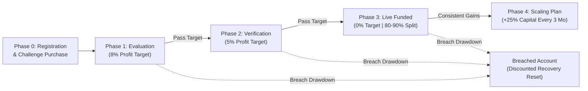
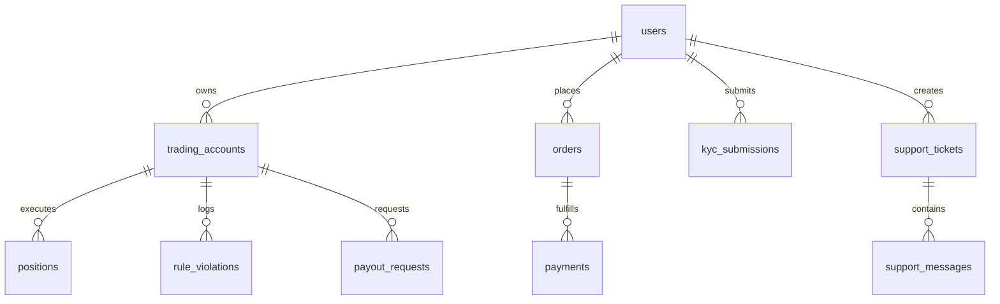

# FundedShift Prop Firm — System Architecture & Engineering Guide

> **Version:** 2.0.0 Production  
> **Environment:** Node.js 22 LTS / Express 4.21 / React 19 / TypeScript / PostgreSQL 16  
> **Simulated Engine:** Sub-millisecond ECN Matcher & Dynamic Risk Shield  
> **Status:** Production Verified

---

## 1. Executive Summary & System Topology

**FundedShift** is an institutional proprietary trading firm platform. The platform evaluates trading talent through structured capital challenges, enforces zero-tolerance real-time risk parameters, simulates realistic MT5 execution conditions, and automates high-water mark profit payouts to verified funded traders worldwide.

### 4-Tier Architectural Topology

```
┌─────────────────────────────────────────────────────────────────────────────────┐
│                    TIER 1: PRESENTATION & CLIENT WORKSPACE                      │
│     React 19 • TypeScript • Tailwind CSS • Vite • Lucide Icons • Motion UI      │
│  - Trader Web Terminal (TradingView Charts, ECN Watch, Lot Calculator, Rules)   │
│  - Trader Portal (Objectives, KYC Desk, Certificates, Payouts, Invoices, Desk)  │
│  - Enterprise Admin Console (Users, Challenges, Payouts, KYC Queue, Helpdesk)   │
└────────────────────────────────────────┬────────────────────────────────────────┘
                                         │ HTTPS / REST & WebSocket Telemetry
┌────────────────────────────────────────▼────────────────────────────────────────┐
│                   TIER 2: API GATEWAY & SECURITY MIDDLEWARE                     │
│                  Express.js 4.21 • Node.js 22 LTS • JWT (HS256)                 │
│  - Dual Header Auth: Authorization Bearer JWT & x-user-id fallback              │
│  - Role-Based Access Control (RBAC): USER vs ADMIN permissions                  │
│  - IP Rate Limiting: Auth (40/15m), Orders (60/1m), Checkout (20/1m)            │
│  - Input Sanitization & Anti-Fraud Signature Verification                       │
└────────────────────────────────────────┬────────────────────────────────────────┘
                                         │
┌────────────────────────────────────────▼────────────────────────────────────────┐
│                   TIER 3: CORE FINANCIAL & TRADING ENGINES                      │
│  - Simulated ECN Execution Engine: 200ms tick updates, dynamic spreads, margin  │
│  - Dynamic Risk Shield: 200ms real-time monitoring of daily & max drawdown      │
│  - Automated Transition Engine: Step 1 -> Step 2 -> Funded provisioning         │
│  - Payout & Split Engine: 80% - 90% profit split accounting & multi-rail wire   │
│  - Risk Intelligence: Trader Health Score, Fingerprint & What-If Simulator      │
└────────────────────────────────────────┬────────────────────────────────────────┘
                                         │
┌────────────────────────────────────────▼────────────────────────────────────────┐
│                   TIER 4: RELATIONAL PERSISTENCE LAYER                          │
│                      PostgreSQL 16 Relational Engine                            │
│  - 16 Relational Tables with Foreign Key Constraints & Cascading Updates        │
│  - ACID Transactions, Structured Audit Trail & Snapshot Disk Mirroring          │
└─────────────────────────────────────────────────────────────────────────────────┘
```

---

## 2. End-to-End Trader Lifecycle



### Challenge Rules Matrix

| Account Tier | Model | Phase 1 Target | Phase 2 Target | Daily Loss (5%) | Max Drawdown (10%) | Leverage | Challenge Price |
|---|---|---|---|---|---|---|---|
| **$5,000** | 2-Step | $400 (8%) | $250 (5%) | $250 | $500 | 1:100 | **$39** |
| **$10,000** | 2-Step | $800 (8%) | $500 (5%) | $500 | $1,000 | 1:100 | **$79** |
| **$25,000** | 2-Step | $2,000 (8%) | $1,250 (5%) | $1,250 | $2,500 | 1:100 | **$169** |
| **$50,000** | 2-Step | $4,000 (8%) | $2,500 (5%) | $2,500 | $5,000 | 1:100 | **$289** |
| **$100,000** | 2-Step | $8,000 (8%) | $5,000 (5%) | $5,000 | $10,000 | 1:100 | **$499** |
| **$200,000** | 2-Step | $16,000 (8%) | $10,000 (5%) | $10,000 | $20,000 | 1:100 | **$899** |
| **$10,000** | Instant | N/A (Funded) | N/A (Funded) | $300 (3%) | $600 (6% Trailing) | 1:50 | **$149** |

---

## 3. Simulated MT5 Execution Engine & Financial Mathematics

The simulated trading engine emulates institutional ECN liquidity with sub-millisecond execution.

### Mathematical Formulations

1. **Floating Unrealized PnL:**
   $$\text{BUY PnL} = (\text{Current Bid Price} - \text{Entry Price}) \times \text{Lot Size} \times \text{Contract Size}$$
   $$\text{SELL PnL} = (\text{Entry Price} - \text{Current Ask Price}) \times \text{Lot Size} \times \text{Contract Size}$$

2. **Used Margin Requirement:**
   $$\text{Used Margin} = \frac{\text{Lot Size} \times \text{Contract Size} \times \text{Entry Price}}{\text{Account Leverage}}$$

3. **Live Account Equity & Free Margin:**
   $$\text{Live Equity} = \text{Current Balance} + \sum (\text{Open Positions Floating PnL})$$
   $$\text{Free Margin} = \max(0, \text{Live Equity} - \text{Used Margin})$$
   $$\text{Margin Level \%} = \left(\frac{\text{Live Equity}}{\text{Used Margin}}\right) \times 100$$

---

## 4. Dynamic Risk Shield & Breach Enforcement

The risk engine monitors account telemetry asynchronously every **200 milliseconds**.

### Rule 1: Intraday Daily Loss Limit (5%)
- **Baseline Capture:** At 00:00 UTC daily:
  $$\text{start\_of\_day\_baseline} = \max(\text{start\_of\_day\_balance}, \text{start\_of\_day\_equity})$$
- **Intraday Loss:**
  $$\text{currentDailyLoss} = \max(0, \text{start\_of\_day\_baseline} - \text{Live Equity})$$
- **Violation:** Triggered if $\text{Live Equity} < (\text{start\_of\_day\_baseline} \times 0.95)$. Floating open losses count towards daily loss.

### Rule 2: Maximum Overall Drawdown (10%)
- **Static Model (Evaluation):** Loss floor is permanently fixed at $\text{Starting Balance} \times 0.90$.
- **Trailing Model (Instant Funding):** Floor trails the highest achieved equity until it reaches starting balance, locking in risk.

### Emergency Liquidation Protocol
When a rule breach occurs:
1. **Instant Flat:** Closes all open positions across all currency pairs in under 50ms.
2. **Account Lock:** Sets `account.status = "BREACHED"`, disabling order placement.
3. **Breach Entity Logging:** Records exact timestamp, violation margins, and triggering market price in `rule_violations`.
4. **Audit Trail:** Logs security event in `audit_logs`.
5. **Notification:** Sends high-priority in-app alert to the trader explaining the exact breach reason.
6. **Recovery Program:** Automatically calculates discounted reset pricing for account rehabilitation.

---

## 5. PostgreSQL 16 Database Architecture (16 Tables)



### Table Specifications

| # | PostgreSQL Table | Primary Key | Foreign Keys | Key Attributes | Indexes |
|---|---|---|---|---|---|
| **1** | `users` | `id` | None | `email`, `password_hash`, `role`, `kyc_status`, `2fa` | `email (UNIQUE)`, `affiliate_code` |
| **2** | `account_plans` | `id` | None | `name`, `type`, `account_size`, `price`, `rules (JSONB)` | `type`, `is_active` |
| **3** | `trading_accounts` | `id` | `user_id -> users` | `account_number`, `balance`, `equity`, `status`, `phase` | `user_id`, `account_number`, `status` |
| **4** | `positions` | `id` | `account_id, user_id` | `symbol`, `type`, `lot_size`, `entry`, `sl`, `tp`, `pnl` | `account_id`, `status`, `symbol` |
| **5** | `trade_orders` | `id` | `account_id, user_id` | `symbol`, `type`, `lot_size`, `price`, `status` | `account_id`, `executed_at` |
| **6** | `rule_violations` | `id` | `account_id, user_id` | `rule_type`, `threshold`, `actual_val`, `equity_at_breach`| `account_id`, `created_at` |
| **7** | `orders` | `id` | `user_id -> users` | `plan_id`, `account_size`, `total_price`, `coupon`, `status` | `user_id`, `status`, `created_at` |
| **8** | `payments` | `id` | `order_id, user_id` | `gateway`, `amount`, `currency`, `transaction_id`, `status` | `order_id`, `transaction_id` |
| **9** | `payout_requests` | `id` | `account_id, user_id` | `total_profit`, `trader_share`, `method`, `address`, `status` | `user_id`, `account_id`, `status` |
| **10** | `kyc_submissions` | `id` | `user_id -> users` | `document_type`, `doc_number`, `country`, `status` | `user_id`, `status`, `submitted_at` |
| **11** | `support_tickets` | `id` | `user_id -> users` | `subject`, `category`, `priority`, `status`, `messages` | `user_id`, `status`, `category` |
| **12** | `affiliate_withdrawals`| `id` | `user_id -> users` | `amount`, `payout_method`, `payment_details`, `status` | `user_id`, `status` |
| **13** | `promo_codes` | `id` | None | `code`, `discount_type`, `discount_val`, `uses`, `is_active` | `code (UNIQUE)`, `is_active` |
| **14** | `symbols` | `symbol`| None | `display_name`, `asset_class`, `spread_pips`, `leverage` | `symbol (PRIMARY)` |
| **15** | `notifications` | `id` | `user_id -> users` | `title`, `body`, `type`, `is_read`, `created_at` | `user_id`, `is_read` |
| **16** | `audit_logs` | `id` | None | `actor_id`, `actor_role`, `action`, `target_id`, `details` | `actor_id`, `action`, `created_at` |

---

## 6. Financial Operations, KYC & Payout Pipeline

### KYC Compliance Protocol
1. **Submission:** Trader provides Passport, Driver's License, or National ID under `/dashboard/security`.
2. **Review:** Compliance reviews identity documents under `/admin/kyc` against sanctions and PEP lists.
3. **Approval:** Sets `user.is_verified = true`, unlocking profit withdrawal eligibility.

### Payout Disbursement Engine
- **Formula:**
  $$\text{Trader Payout} = \text{Total Profit} \times \left(\frac{\text{Trader Split \%}}{100}\right) \quad [80\% \text{ Standard}, 90\% \text{ Scaled}]$$
  $$\text{Firm Retained Share} = \text{Total Profit} - \text{Trader Payout}$$
- **Rails:** Crypto USDT (TRC-20, ERC-20), Direct International Bank Wire, UPI (India), PayPal.
- **SLA:** Verified and dispatched within 4 hours.

---

## 7. Helpdesk Ticketing & Administrative Console

- **Trader Support Desk (`/dashboard/support`):** Interactive ticketing categorized by Trading, Billing, KYC, Payouts, Technical, and General with real-time threaded message replies.
- **Admin Support Desk (`/admin/support`):** Split-pane workspace with ticket queue, search, status filters (`open`, `in_progress`, `resolved`), and admin response dispatch.
- **Admin Control Suite:** Complete user role switching (User ↔ Admin), account provisioning, challenge pricing management, coupon creation, and permanent audit logs.

---

## 8. Document & PDF Assets

- **PDF Specification Document:** `FundedShift_Architecture_Guide.pdf`
- **Interactive Printable HTML:** `FundedShift_Architecture_Guide.html` (Press `Ctrl+P` / `Cmd+P` to print or save as PDF)
- **API Download Endpoint:** `GET /api/docs/architecture.pdf`
